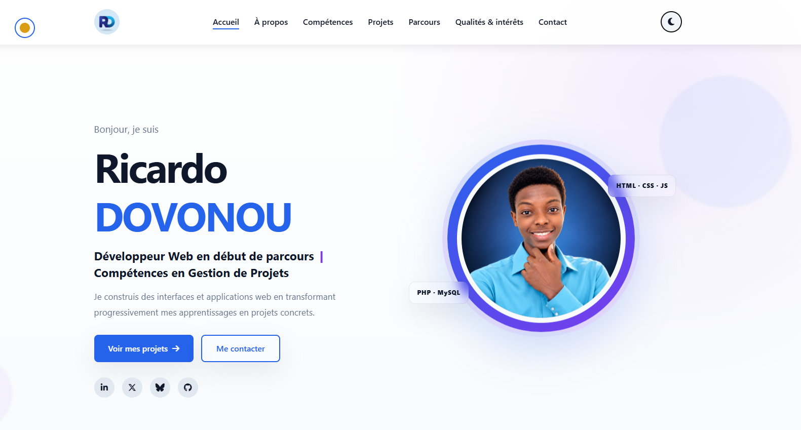

# Portfolio - Ricardo DOVONOU

Portfolio personnel de **Ricardo DOVONOU**, développeur web en début de parcours au Bénin, présentant mon profil, mes compétences et mes projets réalisés en formation et en autoformation.

🔗 **Démo en ligne :**



## Fonctionnalités

- Design responsive (mobile, tablette, desktop)
- Thème clair / sombre avec mémorisation du choix (`localStorage`) et détection de la préférence système
- Navigation par ancres avec indicateur de progression du scroll
- Filtrage des projets par catégorie (Fullstack, JavaScript, Front-end)
- Formulaire de contact (ouverture directe du client email)
- Icônes FontAwesome hébergées en local (aucune dépendance externe au chargement)

## Technologies utilisées

- **HTML5** - structure sémantique
- **CSS3** - mise en page (Flexbox, Grid), variables CSS pour les thèmes, animations
- **JavaScript (vanilla)** - interactions, bascule de thème, filtrage des projets, révélations au scroll
- **Font Awesome** (en local, sans CDN) - iconographie

Aucun framework, build tool ou dépendance externe : le site fonctionne directement en ouvrant `index.html`, ce qui le rend simple à héberger gratuitement.

## Structure du projet

```
myportfolio-officiel/
├── index.html              # Page principale
├── style.css                # Styles (thèmes clair/sombre inclus)
├── script.js                 # Interactions (thème, filtres, scroll)
├── assets/
│   └── fontawesome/          # Icônes (CSS + polices), hébergées en local
└── images/
    ├── projet/                # Aperçus des projets présentés
    └── ...                    # Photos et illustrations du portfolio
```

## À propos

Ce portfolio présente notamment :

- **Gestion de produits et commandes** (PHP / MySQL)    : application avec authentification et gestion des rôles
- **Task List** (JavaScript)                            : gestion de tâches dynamique
- **Company Website** et **CV Web** (HTML / CSS)
- **AvôTché**                                           : projet de fin de formation (en cours d'amélioration)

D'autres projets sont disponibles sur mon [GitHub](https://github.com/DocariDR).

## Contact

- **Email :**       ricardovonoupro@gmail.com
- **LinkedIn :**    [ricardo-dovonou](https://www.linkedin.com/in/ricardo-dovonou)
- **X (Twitter) :** [@DocariRD](https://x.com/DocariRD)
- **Bluesky :**     [docaridr.bsky.social](https://bsky.app/profile/docaridr.bsky.social)
- **GitHub :**      [DocariDR](https://github.com/DocariDR)

---

© Ricardo DOVONOU. Tous droits réservés.
